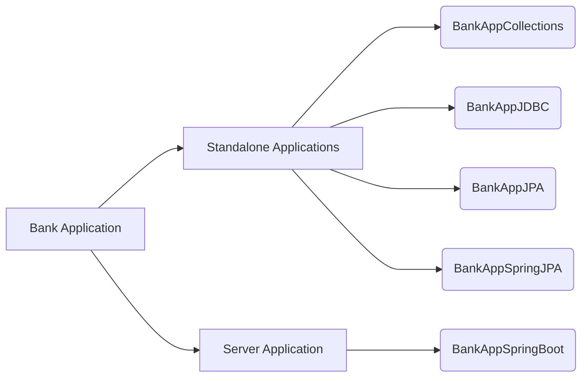

# Bank Server Application

Application that provides REST Service endpoints to facilitate banking functions.
___

## Tools and Technologies Used:
|Language    |Framework    |Database    |Build System    |Containerization    |Hosting    |
|---|---|---|---|---|---|
___

## Project Structure
### Branches

### How to run

- Switch to the respective branch and follow the detailed instructions
